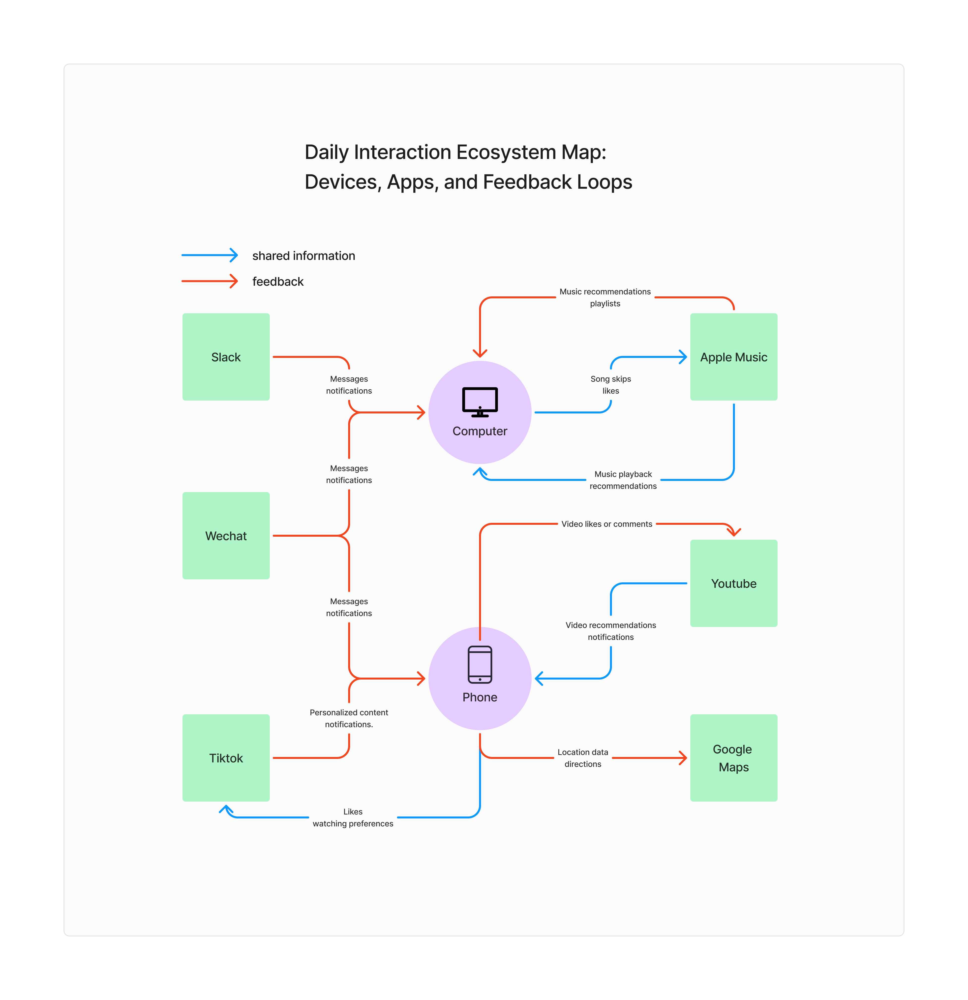
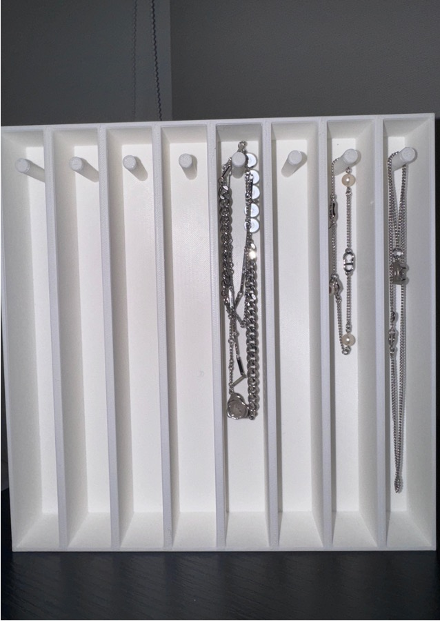
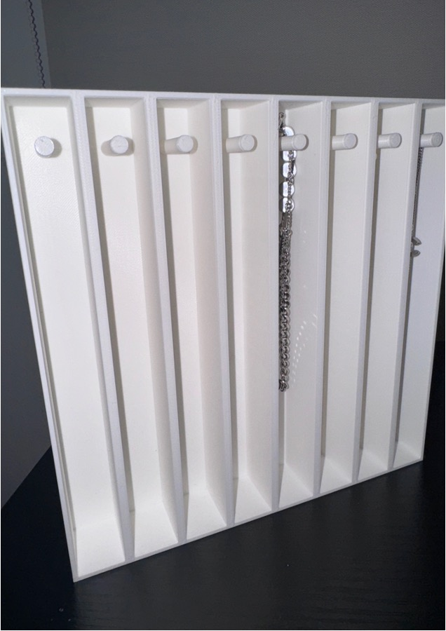
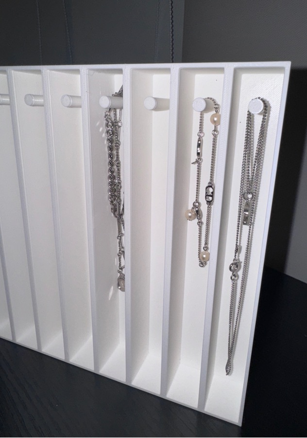
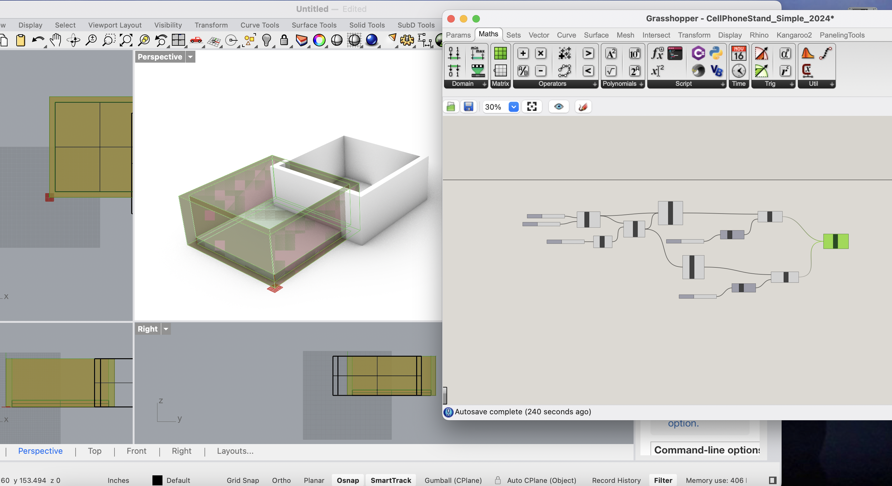
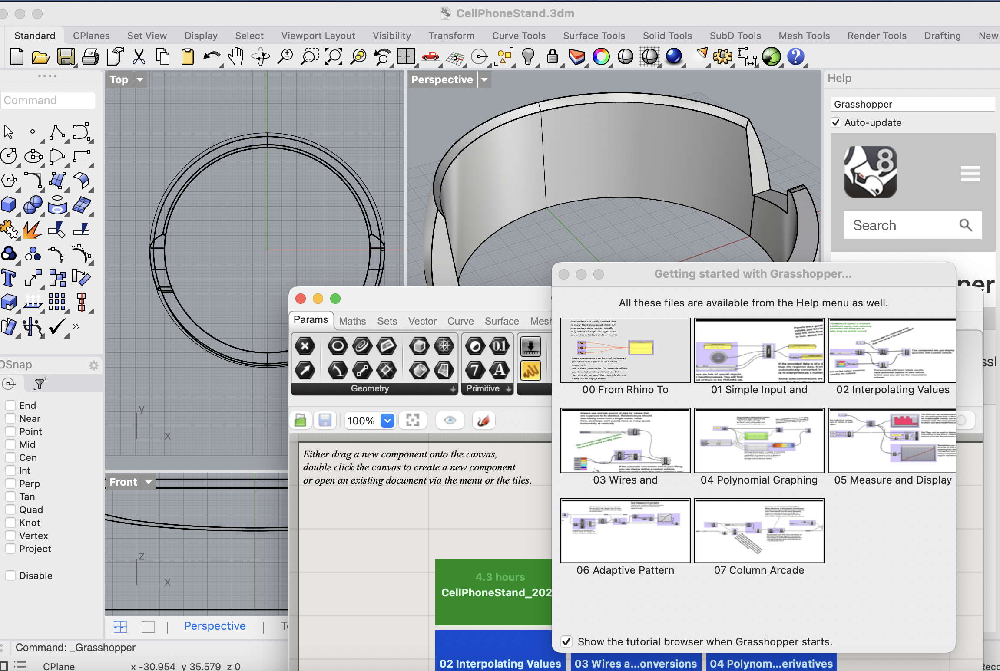

# Outline
[week 1](README.md#week-1-report-1)
[week 2](README.md#week-2-report-1)
[week 3](README.md#week-3-report-1)
[week 4](README.md#week-4-report-1)

# Week 4: Report 1 #
## Week of 09/26/2024
Weekly Report

This map visualizes the interactions between my primary devices (Phone and Computer) and the apps I use daily, including YouTube, TikTok, Apple Music, Google Maps, Slack, and WeChat. It highlights the connections, information flow, and feedback loops within this ecosystem.
Connections: The map shows how different apps are accessed from both my Phone and Computer. Some apps, like Google Maps, are primarily used on my Phone, while others, such as Wechat, is used on both devices.
Information Flow: Arrows indicate the types of data or content that flow between devices and apps. For instance, YouTube sends video recommendations and notifications to both my Phone and Computer, while Google Maps delivers location data to my Phone.
Feedback Loops: These loops represent how my actions, such as liking videos or skipping songs, feed back into the apps to influence future recommendations. For example, my preferences on Apple Music affect the recommendation in the future.

# Week 3: Report 1 #
## Week of 09/19/2024
Weekly Report

This week, I began by researching necklace organizers. I found that while many designs look aesthetically pleasing, they don’t effectively prevent necklaces from tangling. This insight guided the direction of my project.
I sketched a tangle-free necklace organizer design and set out to bring it to life using Rhino and Grasshopper for the first time. I spent a lot of time learning the basics, combining multiple tutorials to understand the software and apply it to my design.
After hours of constructing and debugging, I completed my first model. However, the first 3D printing attempt failed due to incorrect sizing. I had to go back to Grasshopper to resize and rebuild the model.
After further research and adjustments in Grasshopper, I resized and rebuilt the model to prepare for a second printing attempt. The revisions should address the sizing issues from the first print.
In addition to working on the model, I spent significant time creating a video to document and present my project. This video highlights the design process, the challenges I faced, and how I overcame them.
This week, I tackled various challenges, from learning new software to debugging and iterating on my design. I also spent time producing a video to showcase the project. Overall, I gained valuable experience in both technical skills and project documentation, and I’m excited for the next steps, including the second print.

The video link is here: https://youtu.be/QFM4S9OghSQ

  

# Week 2: Report 1 #
## Week of 09/11/2024

This week, I focused on adjusting the parameters for a phone stand model. I discovered that some changes resulted in noticeable variations, while others caused errors (I now understand that red indicates an error). After asking a classmate for help, I learned that pressing a specific button can reveal the function of certain components, which was very helpful in troubleshooting.

I followed a tutorial to create my own model, which was my first time working with Grasshopper. I realized that it operates much like a programming environment. During this process, I familiarized myself with concepts like "flatten" and "bake," and successfully created an object. I also explored a range of other features within the software.

Additionally, I attended a 3D printing lecture. I’m excited about the possibility of one day printing a 3D object that I’ve designed myself.

# Week 1: Report 1 #
## Week of 09/04/2024

This week, I reviewed the outline, learned the basics of laser cutting and 3D printing, and completed the quiz. I also downloaded Rhino and started playing with Grasshopper. Since I’m not very familiar with it, I signed up for a Grasshopper workshop.

## Quick Links, compiled here for your convenience: ##

- [TDF Wiki](https://github.com/Berkeley-MDes/24f-desinv-202/wiki) - the ultimate source for truth and information about the course and assignments
- [Google Drive Folder](https://drive.google.com/drive/u/0/folders/1DJ1b6sSDwHXX6NRcQYt10ivyQSgU0ND6) - slides and other resources
- [bCourses](https://bcourses.berkeley.edu/courses/1537533) - where the grading happens
