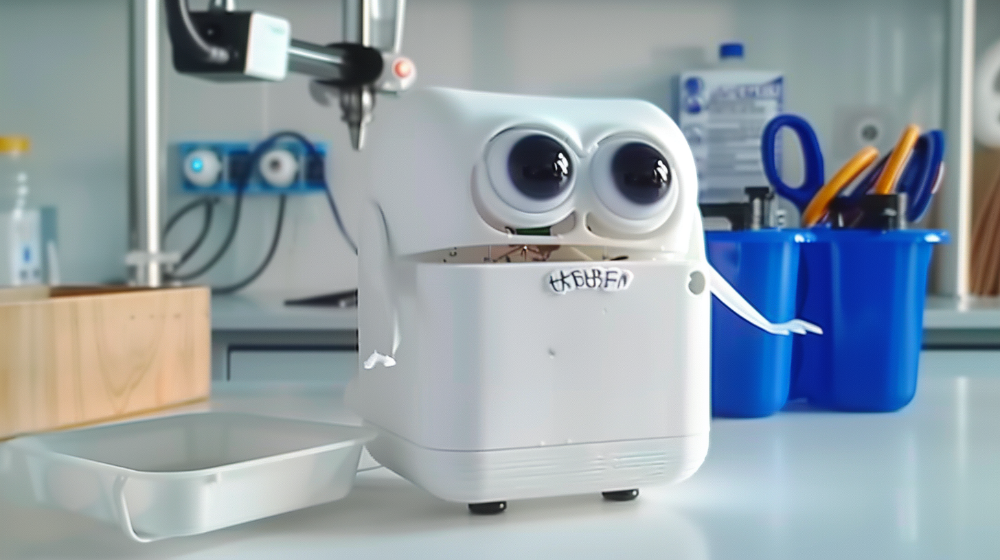

# Outline
[week 1](README.md#week-1-report-1)
[week 2](README.md#week-2-report-1)
[week 3](README.md#week-3-report-1)
[week 4](README.md#week-4-report-1)
[week 5](README.md#week-5-report-1)
[week 6](README.md#week-6-report-1)
[week 7](README.md#week-7-report-1)
[week 8](README.md#week-8-report-1)
[week 9](README.md#week-9-report-1)
[week 10](README.md#week-10-report-1)

# Week 10: Report 1 #
## Week of 11/07/2024
I began developing the final version of my interactive LLM portfolio, building on the knowledge and skills from the initial exercises. The core goal was to create a prototype capable of answering the eight targeted questions I had identified as essential for showcasing my work and experience. This development process involved a deeper integration of Retrieval-Augmented Generation (RAG) to enhance the model's ability to access and retrieve relevant external knowledge, which proved to be a critical addition for providing context-rich responses. RAG integration broadened the model’s knowledge base, making it especially useful for addressing factual and complex queries with a higher level of precision.
In Experiment 3, I observed that RAG-enabled responses provided not only better context but also aligned more accurately with user intent, demonstrating the value of external knowledge retrieval in enhancing response depth.
Alongside RAG, I introduced variable customization to fine-tune the model’s responses based on user preferences, such as adjusting the tone, formality, and detail of answers. This was particularly insightful in Experiment 4, where I explored how adjustable variables could make interactions feel more personalized. The flexibility allowed the model to dynamically shift its responses, creating a more user-centered experience. I prepared a presentation to explain the design choices, challenges, and the technical features integrated into this prototype. Presenting my work helped clarify the design logic, and it underscored the importance of instruction design in guiding model behavior. For example, in Experiment 2, adding structured instructions to the model's input significantly improved the relevance of responses, making it easier for the model to adhere to the intended direction of the query.

# Week 9: Report 1 #
## Week of 10/31/2024
I started with the foundational exercises to understand the ZeroWidth platform, which were instrumental in building my knowledge of interactive LLM development. These initial exercises included understanding how to use different model settings, structuring prompts, and exploring temperature adjustments. This exploration allowed me to see the immediate impact of model parameter changes on response quality. 
For instance, adjusting the temperature setting in the Basic GPT Interaction experiment showed that lower temperatures resulted in more factual, consistent responses, while higher temperatures encouraged creative, varied answers, albeit sometimes at the expense of accuracy. This balance between precision and creativity became a key insight, as I considered how to apply it to different use cases in my project.
Furthermore, I worked on basic error-handling functions, experimenting with ways the system could detect and address errors in real time. This led me to think critically about the importance of feedback processing and context adjustment in maintaining smooth, user-friendly interactions. In creating the system architecture diagram, I illustrated the core components: the "User Interface," "Knowledge Search" (using RAG for added depth), "Error Handling," "Output to User," "Feedback Processing," and "Context Adjustment." Each component serves a specific function in managing the flow of information from user input to output, and my initial focus on error handling and context maintenance set the stage for the more advanced development that would follow.

# Week 8: Report 1 #
## Week of 10/24/2024
This week, my main responsibilities included setting up cloud communication, handling some of the 3D printing work, and creating and organizing the project’s PowerPoint presentation.

Firstly, for the cloud communication, I successfully completed the setup of the cloud communication system. This involved configuring the Particle Photon 2 module to ensure that real-time updates on the trash bin’s status were sent to the cloud when it was full or emptied. This allowed for seamless monitoring and accurate data transmission.

In terms of 3D printing, I contributed to the design and printing of the robot's key components. After an initial failure in the first print due to connection issues, I made adjustments to the design and improved the aesthetic and functionality of the trash bin cap. I also performed tests, such as servo and ultrasonic testing, to verify that the robot could autonomously detect waste and operate the lid for waste disposal.

Lastly, I took charge of creating and organizing the PowerPoint presentation for the project. This involved designing slides that clearly communicated the system’s architecture, prototype development, emotional feedback features, and cloud-based monitoring. I made sure that the presentation had a consistent visual style and clearly conveyed the technical and social aspects of the project.

# Week 7: Report 1 #
## Week of 10/17/2024
project. We spent a lot of time brainstorming and discussing different ideas, exploring various possibilities before finally settling on a new challenge: using a breadboard as part of our design exploration. This was an exciting shift, as it pushed us to think creatively about how we could integrate it into our overall concept.

After much discussion, we agreed on the idea of building a robot that "eats" trash and criticizes human waste management habits. This concept reflects our goal of addressing environmental issues while incorporating an interactive element that engages users. I took the lead in creating the diagram and drafting the proposal, both of which were crucial in solidifying our direction. We had several meetings where I contributed by refining the modeling and working on the basic web design layout to support our concept.

At the same time, I have been diving deeper into learning how to program with a breadboard and exploring more advanced aspects of the Photon microcontroller. It’s been a rewarding challenge, and I feel like my technical skills are growing as a result. Overall, it was a busy but productive week, and I’m looking forward to seeing how we can further develop this project in the coming weeks.

# Week 6: Report 1 #
## Week of 10/10/2024
Stemma QT Project: Individual Assignment

This week, I focused extensively on the Stemma QT project, which involved both hardware and software components. The first task was to solder the Stemma QT interface board, an essential step to ensure proper communication between the sensors and the microcontroller. I faced a few challenges during the soldering process, especially in terms of maintaining clean connections and troubleshooting initial errors, but I worked closely with my classmates, and we supported each other in overcoming these difficulties.

After completing the soldering, I moved on to the next phase: integrating the system using Visual Studio Code. This turned out to be more complex than expected, as I encountered several issues, including network connection problems and inconsistent sensor outputs. Initially, the system didn’t display any significant changes, which required deeper investigation into the firmware and sensor configurations. I spent considerable time troubleshooting, experimenting with mapping functions, and printing sensor values to the serial monitor to better understand the problem.

These inconsistencies pushed me to collaborate even more closely with my classmates. We discussed potential solutions, and I invested extra hours revisiting the code and testing different approaches to stabilize the sensor outputs. By the end of the week, I had gained a much clearer understanding of the network and sensor integration, and I documented all findings to ensure smooth progression for the next stages of this assignment.

In parallel with the Stemma QT project, my group and I have been working on a separate proposal for our team project, the Smart Waste Disposal Robot. This project aims to develop an autonomous waste disposal robot with emotional feedback, encouraging users to engage in more mindful waste management.

Our group spent a lot of time discussing different aspects of the project. We identified three key inputs—ultrasonic sensors for detecting waste, an IMU for tracking movement, and cloud communication to report bin status. After several brainstorming sessions and long discussions, we finalized a detailed proposal, which outlines our project goals, system architecture, and planned experiments.

We decided to divide responsibilities based on our individual strengths. I am focusing on managing the cloud communication aspect, ensuring that data from the sensors is transmitted effectively to the cloud and feedback is relayed back to the user. I’m also responsible for documentation and will be producing a video to showcase our progress.

Our group decided to push beyond the initial concept by experimenting with new ideas, including emotional interactions and real-time feedback. We are all excited to explore these creative avenues and see how they enhance the user experience. Despite the challenges, I’m really proud of how our group came together to develop this proposal, and I’m confident it will guide us effectively through the implementation phase.

# Week 5: Report 1 #
## Week of 10/03/2024

This week, I attempted three practice exercises. I was able to quickly figure out the "Hello World" task. However, I got stuck for a long time on "Make it Blink." I couldn’t find the four corner buttons, and after asking a classmate for help, I realized I needed to modify the circuit diagram to use two buttons instead. At the same time, I encountered more issues when I tried to work on this at home.

Even though I have a programming background, I am completely unfamiliar with the Particle board and the Arduino environment. I spent a lot of time trying to get everything connected, and while I did get the blink to work, it didn’t speed up as intended. I'm still troubleshooting this problem.

Additionally, I am working on figuring out the RGB LED color variations and trying to learn the differences. I feel a bit lost, as I find it challenging to grasp something entirely new, but I also feel a sense of excitement as I explore this. Despite these efforts, I’ve realized this isn’t a direction I particularly enjoy, and I feel like I’m not very good at it.

# Week 4: Report 1 #
## Week of 09/26/2024
Weekly Report

This map visualizes the interactions between my primary devices (Phone and Computer) and the apps I use daily, including YouTube, TikTok, Apple Music, Google Maps, Slack, and WeChat. It highlights the connections, information flow, and feedback loops within this ecosystem.
Connections: The map shows how different apps are accessed from both my Phone and Computer. Some apps, like Google Maps, are primarily used on my Phone, while others, such as Wechat, is used on both devices.
Information Flow: Arrows indicate the types of data or content that flow between devices and apps. For instance, YouTube sends video recommendations and notifications to both my Phone and Computer, while Google Maps delivers location data to my Phone.
Feedback Loops: These loops represent how my actions, such as liking videos or skipping songs, feed back into the apps to influence future recommendations. For example, my preferences on Apple Music affect the recommendation in the future.

# Week 3: Report 1 #
## Week of 09/19/2024
Weekly Report

This week, I began by researching necklace organizers. I found that while many designs look aesthetically pleasing, they don’t effectively prevent necklaces from tangling. This insight guided the direction of my project.
I sketched a tangle-free necklace organizer design and set out to bring it to life using Rhino and Grasshopper for the first time. I spent a lot of time learning the basics, combining multiple tutorials to understand the software and apply it to my design.
After hours of constructing and debugging, I completed my first model. However, the first 3D printing attempt failed due to incorrect sizing. I had to go back to Grasshopper to resize and rebuild the model.
After further research and adjustments in Grasshopper, I resized and rebuilt the model to prepare for a second printing attempt. The revisions should address the sizing issues from the first print.
In addition to working on the model, I spent significant time creating a video to document and present my project. This video highlights the design process, the challenges I faced, and how I overcame them.
This week, I tackled various challenges, from learning new software to debugging and iterating on my design. I also spent time producing a video to showcase the project. Overall, I gained valuable experience in both technical skills and project documentation, and I’m excited for the next steps, including the second print.

The video link is here: https://youtu.be/QFM4S9OghSQ

  

# Week 2: Report 1 #
## Week of 09/11/2024

This week, I focused on adjusting the parameters for a phone stand model. I discovered that some changes resulted in noticeable variations, while others caused errors (I now understand that red indicates an error). After asking a classmate for help, I learned that pressing a specific button can reveal the function of certain components, which was very helpful in troubleshooting.

I followed a tutorial to create my own model, which was my first time working with Grasshopper. I realized that it operates much like a programming environment. During this process, I familiarized myself with concepts like "flatten" and "bake," and successfully created an object. I also explored a range of other features within the software.

Additionally, I attended a 3D printing lecture. I’m excited about the possibility of one day printing a 3D object that I’ve designed myself.

# Week 1: Report 1 #
## Week of 09/04/2024

This week, I reviewed the outline, learned the basics of laser cutting and 3D printing, and completed the quiz. I also downloaded Rhino and started playing with Grasshopper. Since I’m not very familiar with it, I signed up for a Grasshopper workshop.

## Quick Links, compiled here for your convenience: ##

- [TDF Wiki](https://github.com/Berkeley-MDes/24f-desinv-202/wiki) - the ultimate source for truth and information about the course and assignments
- [Google Drive Folder](https://drive.google.com/drive/u/0/folders/1DJ1b6sSDwHXX6NRcQYt10ivyQSgU0ND6) - slides and other resources
- [bCourses](https://bcourses.berkeley.edu/courses/1537533) - where the grading happens
